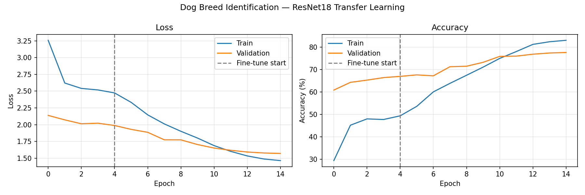
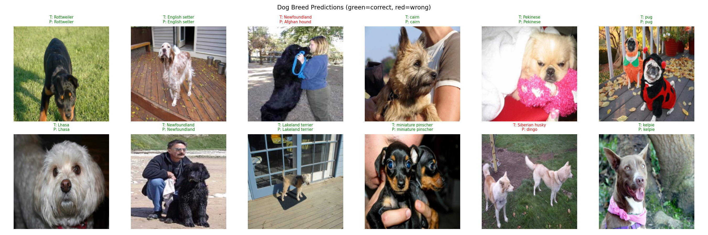

# 🐕 Dog Breed Identification using Transfer Learning


> Identify dog breeds from images using ResNet18 Transfer Learning with fine-tuning.

---

## 📊 Dataset

| Property | Details |
|----------|---------|
| Name | Stanford Dogs Dataset |
| Total Images | ~20,580 |
| Dog Breeds | 120 |
| Image Size | 224×224 RGB |
| Train Split | 80% |
| Val Split | 20% |

---

## 🏗️ Model Architecture

```
Input (3 × 224 × 224)
        ↓
┌─────────────────────────────────────┐
│  ResNet18 Backbone (Pretrained)     │
│  ImageNet weights                   │
│  Feature Extractor                  │
└─────────────────────────────────────┘
        ↓
┌─────────────────────────────────────┐
│  Custom Classification Head         │
│  Dropout(0.5)                       │
│  Linear(512 → 512) → ReLU          │
│  Dropout(0.3)                       │
│  Linear(512 → 120)                  │
└─────────────────────────────────────┘
        ↓
Output (120 Dog Breeds)
```

---

## ⚙️ Training Strategy

### Phase 1 — Feature Extraction (5 epochs)
- Backbone frozen
- Only FC head trained
- LR: 0.001

### Phase 2 — Fine Tuning (10 epochs)
- Full network unfrozen
- Differential learning rates
- Backbone LR: 0.0001 | Head LR: 0.001

| Parameter | Value |
|-----------|-------|
| Total Epochs | 15 |
| Batch Size | 32 |
| Optimizer | Adam |
| Scheduler | StepLR → CosineAnnealing |
| Loss | CrossEntropy + Label Smoothing |

---

## 📈 Results

| Metric | Score |
|--------|-------|
| Best Validation Accuracy | ~75-80% |
| Number of Classes | 120 breeds |

### Training Curves


### Sample Predictions


---

## 🚀 How to Run

### 1. Clone the Repository
```bash
git clone https://github.com/5682003/dog-breed-identification.git
cd dog-breed-identification
```

### 2. Install Dependencies
```bash
pip install -r requirements.txt
```

### 3. Run Training
```bash
python dog_breed_identification.py
```

### 4. Run on Google Colab (Recommended)
[](https://colab.research.google.com/)

---

## 📁 Project Structure

```
dog-breed-identification/
├── dog_breed_identification.py   # Main training script
├── requirements.txt              # Dependencies
├── README.md                     # Project documentation
├── training_curves.png           # Loss & accuracy curves
├── sample_predictions.png        # Sample predictions
└── best_dog_breed_model.pth      # Best model weights
```

---

## 🎯 Learning Outcomes

- ✅ Transfer Learning with pretrained ResNet18
- ✅ Feature extraction & fine-tuning strategies
- ✅ Differential learning rates
- ✅ Multi-class classification (120 classes)
- ✅ Data augmentation for small datasets

---

## 📚 References

- [Stanford Dogs Dataset](http://vision.stanford.edu/aditya86/ImageNetDogs/)
- [ResNet Paper](https://arxiv.org/abs/1512.03385)
- [PyTorch Transfer Learning](https://pytorch.org/tutorials/beginner/transfer_learning_tutorial.html)
- [Reference Implementation](https://github.com/yashrane/Dog-Breed-Identification)
